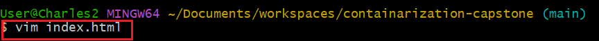
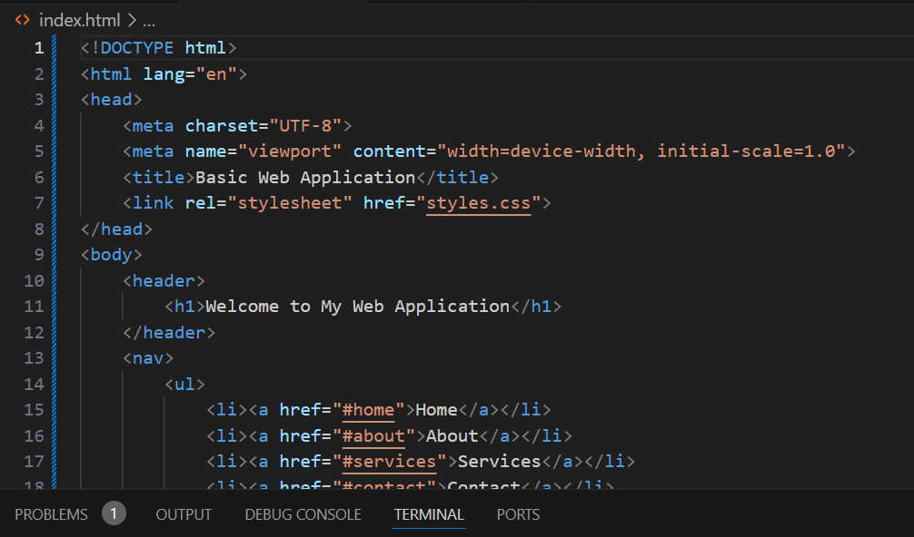

# containarization and Container Orchestration Project
# Aim:
Containerization of a simple static website (HTML and CSS) application for a company's landing page using docker and deploying it to a kubernetes cluster, and access it through Ngnix.
## Setting up website
- The project directory was created 

- The HTML file was created usin `vim` syntax.

- The CSS file was created.

## Git initialization
- Git repository was initialized in the capstone project directory by creating the directory from repository and cloning it on bash.

## Git commit
- The added HTML and CSS file was added, commit and push to remote repository.

## Dockerization of the application
- Dockerfile specifyig Ngnix as a base image was created.

- codes for website was added to the HTML file.

- codes for website was added to the css file.

- The HTML and CSS files were copied into Nginx HTML directory.

- The docker image was built.

## Pushing the docker image to docker hub
- The docker hub was logged in.
- The docker image was tag.

- Docker image was push to docker hub.

## Setting up kind kubernetes cluster
- The kind kubernete was in docker.

- Creating kind cluster.

## Deploying Kubernetes
- Creating YAML file for kubernetes deployment.

- The kubernetes deployemnt was deploy to the kind cluster using `kubectl apply --f services.yaml` syntax

- The kubernetes deployment was verify using    `kubectl get services` syntax. 

## Accessing the Application
- The created appication was port-forwarded to the service to access application locally.

- Visualizing the frontend application on the browser using the port '8080'
